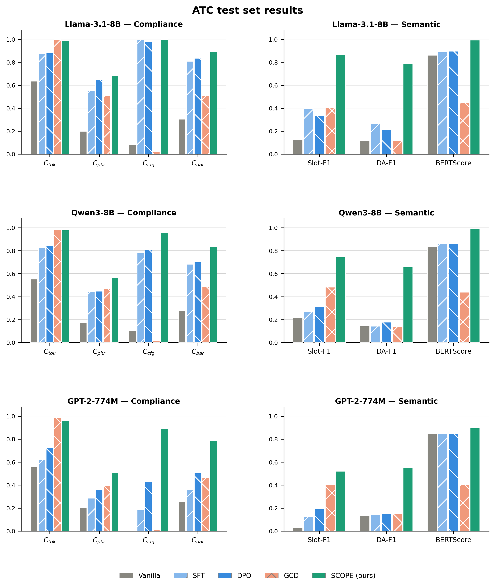

# ATC Chatbot for UAV Operators

An AI-driven communication support system that assists **Unmanned Aerial
Vehicle (UAV)** operators in navigating controlled airspace. The system
fine-tunes causal language models to generate ATC-compliant responses,
enforcing strict adherence to aviation phraseology defined in ICAO Doc 4444
and FAA JO 7110.65.

---

## 📊 Results on ATC Test Set (n = 131)



SCOPE achieves the best result on every metric across all three models.
The only exception is C_tok, where GCD scores higher by token masking —
at the cost of a ~50% BERTScore collapse and DA-F1 reverting to
zero-shot level.


### Llama-3.1-8B-Instruct

| Method | C_cfg↑ | C̄↑ | DA-F1↑ | Slot-F1↑ | Hall%↓ | BERTScore↑ |
|---|---|---|---|---|---|---|
| Vanilla | 0.079 | 0.304 | 0.117 | 0.125 | 42.0 | 0.861 |
| SFT | 0.995 | 0.808 | 0.267 | 0.397 | **0.0** | 0.889 |
| DPO | 0.976 | 0.834 | 0.211 | 0.336 | **0.0** | 0.896 |
| GCD | 0.017 | 0.507 | 0.117 | 0.405 | **0.0** | 0.447 |
| **SCOPE (ours)** | **0.999** | **0.890** | **0.788** | **0.866** | **0.0** | **0.991** |

### Qwen3-8B

| Method | C_cfg↑ | C̄↑ | DA-F1↑ | Slot-F1↑ | Hall%↓ | BERTScore↑ |
|---|---|---|---|---|---|---|
| Vanilla | 0.103 | 0.275 | 0.144 | 0.219 | 28.2 | 0.835 |
| SFT | 0.780 | 0.682 | 0.141 | 0.272 | 4.6 | 0.863 |
| DPO | **0.809** | 0.700 | 0.177 | 0.313 | 2.3 | 0.864 |
| GCD | 0.012 | 0.488 | 0.139 | 0.481 | **0.0** | 0.437 |
| **SCOPE (ours)** | 0.957 | **0.835** | **0.656** | **0.744** | **0.0** | **0.989** |

### GPT-2 Large (774M)

| Method | C_cfg↑ | C̄↑ | DA-F1↑ | Slot-F1↑ | Hall%↓ | BERTScore↑ |
|---|---|---|---|---|---|---|
| Vanilla | 0.003 | 0.254 | 0.130 | 0.025 | 96.2 | 0.847 |
| SFT | 0.181 | 0.363 | 0.139 | 0.122 | 41.2 | 0.846 |
| DPO | 0.427 | 0.504 | 0.147 | 0.191 | 13.0 | 0.849 |
| GCD | 0.008 | 0.462 | 0.146 | 0.405 | **0.0** | 0.405 |
| **SCOPE (ours)** | **0.891** | **0.787** | **0.553** | **0.520** | **0.0** | **0.897** |

**Metrics:** C_cfg = grammar conformance, C̄ = aggregate compliance,
DA-F1 = dialogue-act F1, Slot-F1 = slot extraction F1,
Hall% = hallucination rate (lower is better), BERTScore with domain-adapted encoder.

---

## 🔑 Key Findings

- **SCOPE eliminates hallucination** across all three models while achieving near-perfect grammar conformance (C_cfg = 0.999 for Llama).
- **Grammar-constrained decoding (GCD) collapses semantics** — achieving high C_tok by token masking causes a ~50% BERTScore drop and DA-F1 that matches the zero-shot baseline.
- **Curriculum learning is essential for GPT-2** — without it, SCOPE degrades GPT-2 below SFT (C_cfg 0.091 vs 0.181). With curriculum, C_cfg reaches 0.891.
- **SCOPE improves DA-F1 and Slot-F1 dramatically** over SFT and DPO, confirming that training-time compliance encoding improves rather than degrades semantic quality.

---

## 🚀 Getting Started

### Installation

```bash
git clone https://github.com/Purdue-AIDA3/ATC_Chatbot
cd ATC_Chatbot
pip install torch==2.2.2 --index-url https://download.pytorch.org/whl/cu121
pip install -r requirements.txt
huggingface-cli login   # required for Llama (gated model)
# Set HuggingFace token in config.json:
```

---

### Running the Frontend

```bash
python frontend.py
```

---

## 📂 Repository Structure

```
ATC_Chatbot/SCOPE/
├── scope_train_curriculum.py        # SCOPE training (with curriculum)
├── scope_train_general.py           # SCOPE training (without curriculum)
├── run_train_all_curriculum.py      # Top-level orchestrator
├── run_all_conditions_curriculum.py # GPT-2: all 13 conditions
├── run_new_models_curriculum.py     # Llama / Qwen3
├── evaluate_gcd_general.py          # GCD baseline evaluation
├── cleanup_weights.py               # Delete weights, keep results
├── requirements.txt
├── vocab_ATC.json                   # ATC vocabulary whitelist
├── ngram_whitelist_ATC.json         # ATC phrase whitelist
├── G_ATC.lark                       # ATC grammar
├── atc_pairs.json                   # Training + validation pairs
├── atc_test.json                    # Test set (131 examples)
└── figures/
    └── atc_metrics.png
```

---

## 🛠 Tech Stack

| Category | Tools |
|---|---|
| Framework | PyTorch, HuggingFace Transformers |
| Models | Llama-3.1-8B-Instruct, Qwen3-8B, GPT-2 Large |
| Grammar parsing | Lark (Earley parser) |
| Hyperparameter search | Optuna |
| Dataset | LDC ATC Corpus (LDC94S14A) |
| Specification | ICAO Doc 4444, FAA JO 7110.65 |

---

## 📄 License

MIT License. The LDC ATC corpus is used for research purposes under the
[LDC User Agreement](https://catalog.ldc.upenn.edu/license/ldc-non-members-agreement.pdf).
