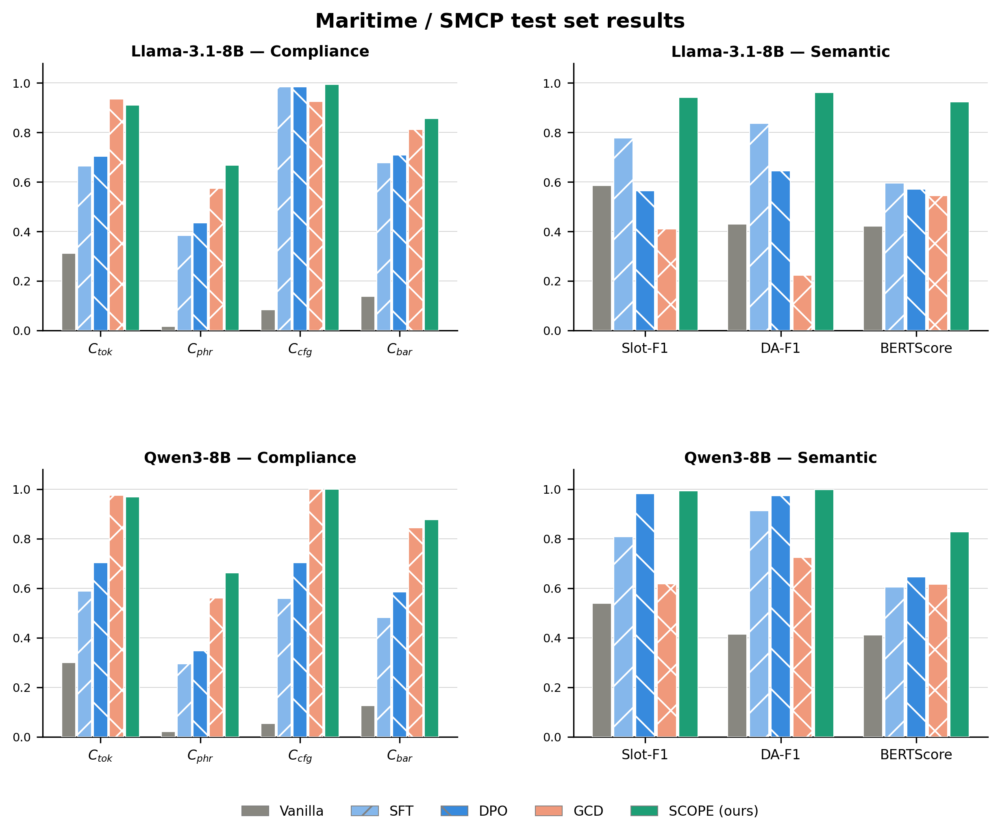

# SCOPE: Hierarchical Grammar-Informed Optimization for Domain-Specific Language Models

SCOPE is a hierarchical multi-objective optimization framework for language
models in safety-critical communication domains e.g. air traffic communication (ATC), 
maritime communication (SMCP). It jointly enforces three level compliance objectives 
during training — **lexical**, **phraseological**, and **syntactic** — 
without any inference-time constraint.

> Paper: *SCOPE: Hierarchical Grammar-Informed Optimization for Domain-Specific
> Language Models* — EMNLP 2026 (under review)
>
> Code: [anonymous.4open.science/r/ATC_Chatbot-6F51/](#) *(anonymised for review)*

---

## Results

### Air Traffic Control (n = 131)


SCOPE achieves the best value on every metric except C_tok, where GCD scores
higher by token masking — at the cost of a ~50% BERTScore collapse.

### Maritime / SMCP (n = 54)



SCOPE achieves near-ceiling semantics: DA-F1 = 0.999 and Slot-F1 = 0.994
for Qwen3-8B, demonstrating transfer to a new regulatory domain from
synthetic data alone.

---

## Repository Structure

```
SCOPE/
│
├── scope_train_general.py           # Standard training (non-curriculum)
├── scope_train_curriculum.py        # Curriculum training
├── run_all_conditions_general.py    # GPT-2: all 13 conditions
├── run_all_conditions_curriculum.py # GPT-2: all 13 conditions, curriculum
├── run_new_models_general.py        # Llama / Qwen3
├── run_new_models_curriculum.py     # Llama / Qwen3, curriculum
├── run_train_all.py                 # Top-level orchestrator
├── run_train_all_curriculum.py      # Top-level orchestrator, curriculum
├── evaluate_gcd_general.py          # Grammar-constrained decoding baseline
├── cleanup_weights.py               # Delete weights, keep results
├── requirements.txt
│
├── vocab_ATC.json                   # ATC vocabulary (2,062 tokens)
├── ngram_whitelist_ATC.json         # ATC phrase whitelist (46,990 n-grams)
├── G_ATC.lark                       # ATC grammar (60+ rules, Lark Earley)
├── atc_pairs.json                   # ATC train + val pairs (832 / 104)
├── atc_test.json                    # ATC test set (131 examples)
│
├── vocab_SMCP.json                  # Maritime vocabulary (258 tokens)
├── ngram_whitelist_SMCP.json        # Maritime phrase whitelist (2,918 n-grams)
├── G_SMCP.lark                      # Maritime grammar (58 rules, Lark Earley)
├── smcp_pairs.json                  # Maritime train + val pairs (428 / 53)
├── smcp_test.json                   # Maritime test set (54 examples)
│
└── figures/
    ├── atc_metrics.png
    └── smcp_metrics.png
```

---

## Installation

```bash
# 1. Install torch with CUDA support (A100, CUDA 12.1)
pip install torch==2.2.2 --index-url https://download.pytorch.org/whl/cu121

# 2. Install remaining dependencies
pip install -r requirements.txt

# 3. Authenticate for Llama (gated model)
huggingface-cli login
```

For 8B models on a **single A100 40 GB**: add `--use_8bit_adam` to reduce
optimizer state memory ~4×. For **2× A100 40 GB**: the script auto-detects
both GPUs and uses `device_map="auto"` with 8-bit Adam automatically.

---

## Quick Start

### Run SCOPE-full on ATC (Llama, single condition)

```bash
python scope_train_curriculum.py \
  --model       meta-llama/Llama-3.1-8B-Instruct \
  --data        atc_pairs.json \
  --test_data   atc_test.json \
  --vocab_path  vocab_ATC.json \
  --phrase_path ngram_whitelist_ATC.json \
  --grammar     G_ATC.lark \
  --domain      atc \
  --output      results/llama/C11 \
  --lr          2.48e-5 \
  --epochs      5 --batch_size 4 --grad_accum 4 \
  --lambda_ce   0.5 --lambda_tok 0.9705 \
  --lambda_phr  0.9009 --lambda_cfg 1.4314 \
  --M_samples   4 --gradnorm --gradnorm_alpha 0.12 \
  --gradient_checkpointing --use_chat_template \
  --early_stop_patience 2 --warmup_ratio 0.1 \
  --max_new_tok 80 \
  --curriculum --curriculum_ramp_steps 50
```

### Run all conditions (orchestrator)

```bash
# ATC — all models, key conditions
python run_train_all_curriculum.py \
  --scope_dir /path/to/SCOPE \
  --domain atc \
  --models gpt2 llama qwen \
  --conditions C2 C3 C11 C4

# ATC — GPT-2 full ablation (all 13 conditions)
python run_train_all_curriculum.py \
  --scope_dir /path/to/SCOPE \
  --domain atc --models gpt2 \
  --conditions all \
  --curriculum_ramp_steps 50

# Maritime
python run_train_all_curriculum.py \
  --scope_dir /path/to/SCOPE \
  --domain smcp --models llama qwen \
  --conditions C2 C3 C11 C4
```

---

## Experimental Conditions

| ID | Name | Objective |
|---|---|---|
| C1 | Vanilla | No fine-tuning |
| C2 | SFT | L_CE only |
| C3 | DPO | Preference optimisation (β = 0.1) |
| C5 | SCOPE-tok | L_CE + L_tok |
| C6 | SCOPE-phr (REINFORCE) | L_CE + L_phr, M = 1 |
| C7 | SCOPE-phr (GRPO) | L_CE + L_phr, M = 4 |
| C8 | SCOPE-cfg | L_CE + L_cfg, M = 4 |
| C9 | SCOPE-2L | L_CE + L_tok + L_phr |
| C10 | SCOPE-REINFORCE | Full SCOPE, M = 1 |
| **C11** | **SCOPE-full** | **Full SCOPE + GradNorm, M = 4 ← proposed** |
| C4a | GCD ∘ Vanilla | GCD at inference on C1 |
| C4 | GCD ∘ SFT | GCD at inference on C2 |
| C4b | GCD ∘ SCOPE | GCD at inference on C11 |

**Tuned hyperparameters** (Llama / Qwen3, Optuna 50 trials):
λ = (0.9705, 0.9009, 1.4314), lr = 2.48 × 10⁻⁵

**GPT-2 Large**: lr = 2 × 10⁻⁴, float32 (bfloat16 incompatible)

---

## Curriculum Learning

Losses are introduced progressively to prevent GRPO reward collapse
in capacity-limited models:

| Phase | Epochs | Active losses |
|---|---|---|
| 1 | 0 – 33% | L_CE only |
| 2 | 33 – 67% | L_CE + L_tok |
| 3 | 67 – 100% | Full condition objective |

Enable with `--curriculum --curriculum_ramp_steps 50`.
Not required for Llama or Qwen3 (GradNorm handles implicit rebalancing).

---

## GCD Baseline

`evaluate_gcd_general.py` applies grammar-constrained decoding at
inference time to any trained checkpoint:

```bash
python evaluate_gcd_general.py \
  --model   results/llama/C2/best \
  --data    atc_test.json \
  --grammar G_ATC.lark \
  --vocab   vocab_ATC.json \
  --phrase  ngram_whitelist_ATC.json \
  --domain  atc \
  --output  results/llama/C4
```

---

## Citation

```bibtex
@inproceedings{scope2026,
  title     = {{SCOPE}: Hierarchical Grammar-Informed Optimization
               for Domain-Specific Language Models},
  author    = {Anonymous},
  booktitle = {Proceedings of EMNLP 2026},
  year      = {2026}
}
```

---

## License

MIT License. The LDC ATC corpus (LDC94S14A) is used for research purposes
under the LDC User Agreement. The synthetic SMCP dataset is released under
MIT for research use only.
